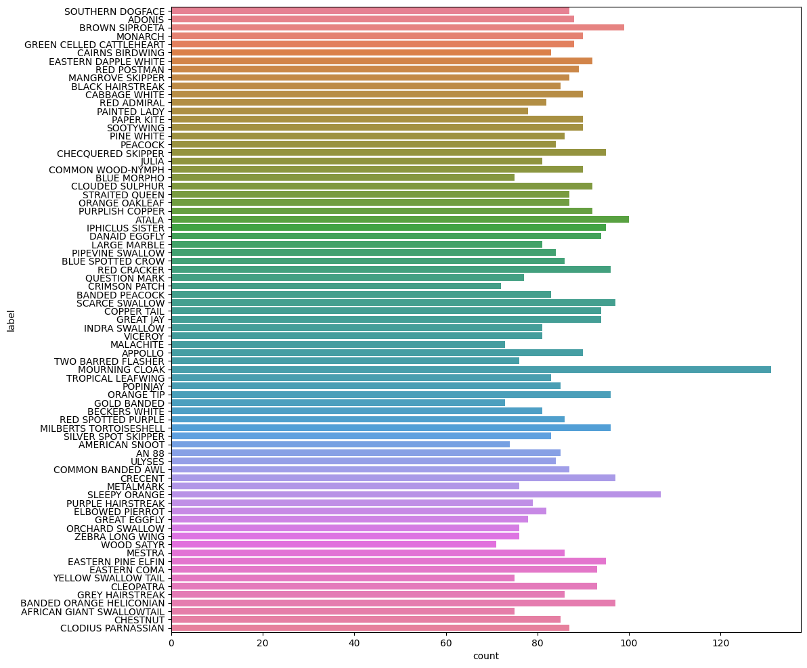
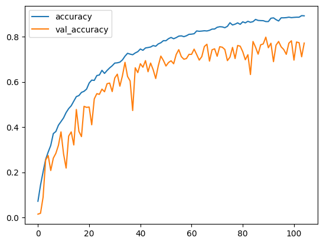
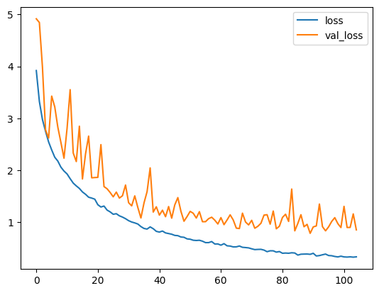
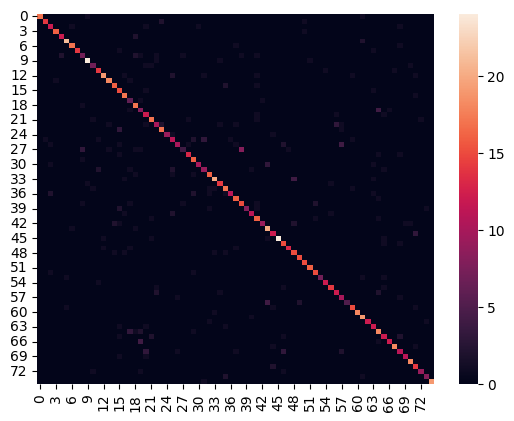
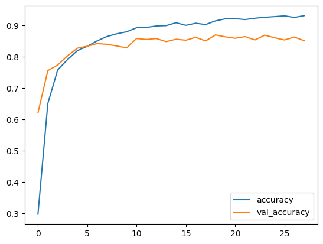
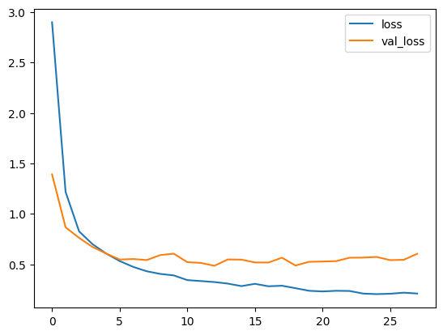
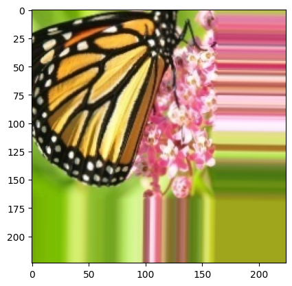

# Butterfly Image Study

A deep learning computer vision project built on a butterfly image dataset, combining **custom CNN classification**, **transfer learning**, and **autoencoder-based image reconstruction** in a single comparative study.

## Project Overview

This project explores multiple deep learning approaches on a fine-grained butterfly image classification task.

The study includes three major components:

- A custom CNN for butterfly species classification
- A transfer learning model for improved classification performance
- An autoencoder for image reconstruction and representation learning

This makes the project more than a standard image classifier — it becomes a broader study of supervised and unsupervised deep learning techniques on the same visual dataset.

## Dataset

The notebook uses the Kaggle dataset:

**Butterfly Image Classification**

The data is accessed using `kagglehub` and includes:

- **6499 labeled training images**
- **2786 test images**
- **75 butterfly species classes**

Example species visible in the notebook include:

- SOUTHERN DOGFACE
- ADONIS
- BROWN SIPROETA
- MONARCH
- APPOLLO
- ATALA

The dataset is organized using image folders plus CSV metadata files:

- `Training_set.csv`
- `Testing_set.csv`

## Part 1: Custom CNN Classification

The first part of the notebook builds a custom convolutional neural network for multi-class butterfly classification.

### Class Distribution



### Classification Accuracy



### Classification Loss



### Classification Confusion Matrix



This section demonstrates end-to-end image classification using a model built from scratch.

### Custom CNN Results

The custom CNN was trained on **5200 training images** and validated on **1299 validation images** using an 80/20 split from the 6499 labeled butterfly images.

**Dataset and setup**

- Total labeled training images: **6499**
- Test images: **2786**
- Number of classes: **75**
- Input size: **224 × 224 × 3**
- Batch size: **32**

**Model summary**

- Architecture: 4 convolution blocks with BatchNorm + ReLU + MaxPooling, followed by GlobalAveragePooling and dense layers
- Total parameters: **498,699**
- Trainable parameters: **497,739**
- Non-trainable parameters: **960**

**Performance**

- Best validation accuracy during training: **79.83%**
- Best validation loss during training: **0.7880**
- Validation accuracy after evaluation: **78.98%**
- Validation loss after evaluation: **0.7961**

**Classification report summary**

- Macro average precision: **0.80**
- Macro average recall: **0.79**
- Macro average F1-score: **0.79**
- Weighted average precision: **0.81**
- Weighted average recall: **0.79**
- Weighted average F1-score: **0.79**

These results show that the custom CNN can learn fine-grained butterfly species classification reasonably well, even across **75 visually similar classes**, while staying relatively lightweight at under **0.5 million parameters**.

## Part 2: Transfer Learning

The second part of the project applies transfer learning to the same butterfly species classification problem.

### Transfer Learning Accuracy



### Transfer Learning Loss



### Transfer Learning Confusion Matrix


This helps compare a pretrained feature extractor against the custom CNN baseline.

## Part 3: Autoencoder Reconstruction

The final part of the notebook uses an autoencoder to reconstruct butterfly images.

### Original Images



### Reconstructed Images


This section explores unsupervised representation learning and image reconstruction on the butterfly dataset.

## Repository Structure

```bash
butterfly_image_study/
│── butterfly_study.ipynb
│── README.md
│── requirements.txt
│── .gitignore
│── images/
│   ├── class_dist.png
│   ├── class_conf.png
│   ├── class_acc.png
│   ├── class_loss.png
│   ├── orig.png
│   ├── reconstruct.png
│   ├── trans_acc.png
│   ├── trans_loss.png
│   └── trans_conf.png
```

## How to Run

1. Clone the repository.
2. Install dependencies:

```bash
pip install -r requirements.txt
```

3. Open the notebook:

```bash
jupyter notebook butterfly_study.ipynb
```

4. Run all cells to:

- download the dataset,
- preprocess the butterfly images,
- train the custom CNN,
- evaluate transfer learning performance,
- and reconstruct images using the autoencoder.

## Highlights

- Fine-grained image classification across 75 butterfly species
- Comparison between custom CNN and transfer learning approaches
- Autoencoder-based image reconstruction
- TensorFlow / Keras computer vision workflow
- Strong comparative deep learning portfolio project

## Future Improvements

- Add top-k prediction visualization for difficult species pairs
- Compare multiple pretrained backbones for transfer learning
- Use the autoencoder encoder as a feature extractor for downstream classification
- Build a lightweight inference demo for butterfly species prediction
